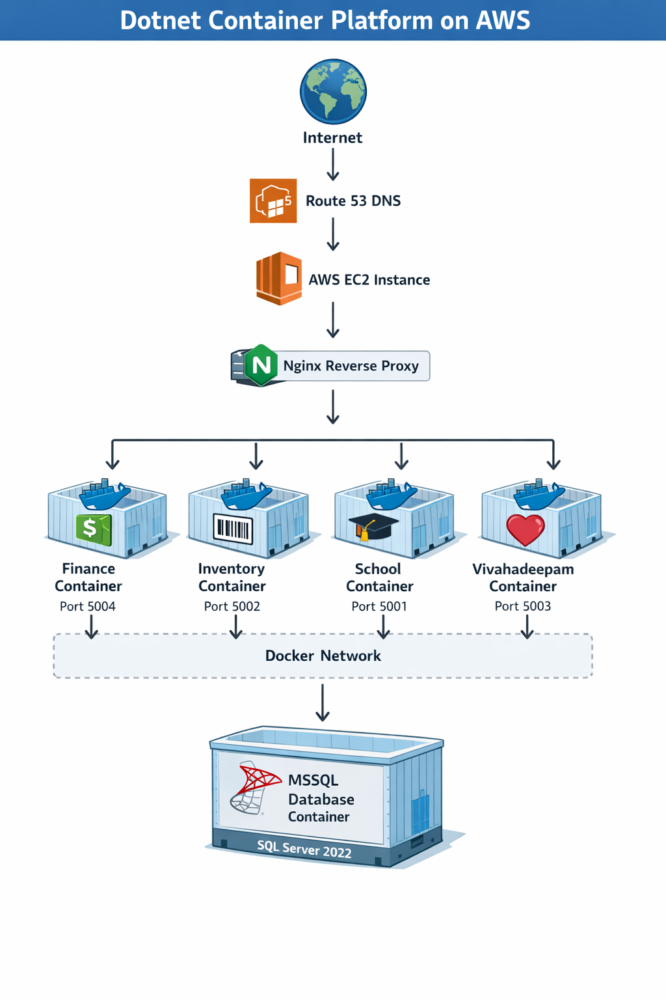
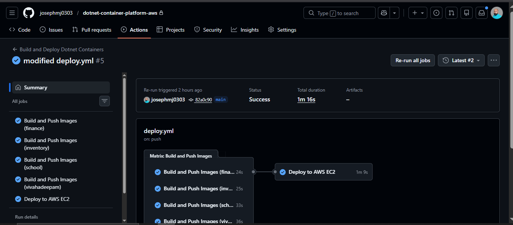
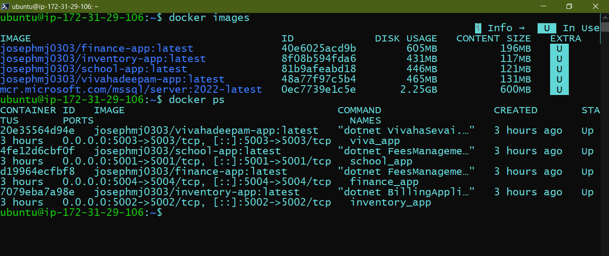
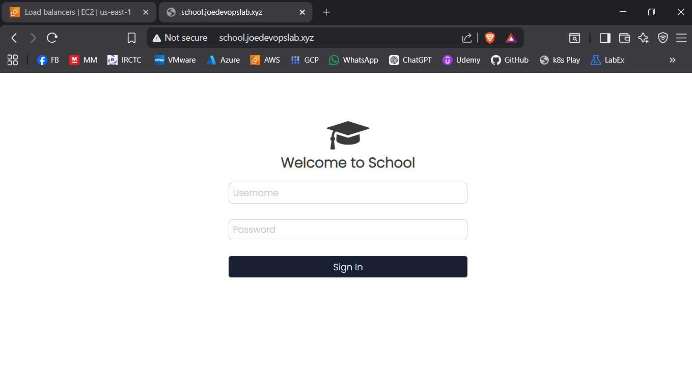
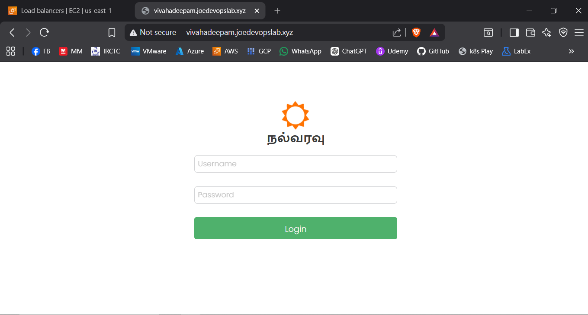

# 🚀 Dotnet Container Platform on AWS


Production-style deployment of multiple ASP.NET Core applications using Docker containers on AWS EC2 with Microsoft SQL Server and Nginx reverse proxy.

This project demonstrates how to containerize legacy or multi-application .NET workloads and deploy them in a production-ready architecture using DevOps practices.

---

## 📌 Project Overview

This repository contains the infrastructure and deployment configuration for hosting multiple ASP.NET Core applications on AWS using Docker containers.

The platform hosts four applications:

* **Finance** – Financial management system
* **Inventory** – Inventory tracking platform
* **School** – School fee management system
* **Vivahadeepam** – Matrimonial service platform

Each application runs inside its own container and connects to a shared Microsoft SQL Server instance running in another container.

Traffic is routed using an Nginx reverse proxy based on domain names.

The project demonstrates practical DevOps skills including:

* Containerization of .NET applications
* Multi-service Docker architecture
* Automated database restoration
* Reverse proxy routing
* Cloud deployment on AWS
* Production style infrastructure layout

---

## 🏗 Architecture



---

## Technology Stack

| Category                | Technology                |
| ----------------------- | ------------------------- |
| Cloud                   | AWS EC2                   |
| Containerization        | Docker                    |
| Container Orchestration | Docker Compose            |
| Runtime                 | ASP.NET Core (.NET 7)     |
| Database                | Microsoft SQL Server 2022 |
| Reverse Proxy           | Nginx                     |
| CI/CD                   | GitHub Actions            |
| DNS                     | Route53                   |
| OS                      | Ubuntu / Debian           |

---

## Repository Structure

```
dotnet-container-platform-aws
│
├── apps
│   ├── finance
│   │   ├── publish
│   │   └── Dockerfile
│   │
│   ├── inventory
│   │   ├── publish
│   │   └── Dockerfile
│   │
│   ├── school
│   │   ├── publish
│   │   └── Dockerfile
│   │
│   └── vivahadeepam
│       ├── publish
│       └── Dockerfile
│
├── mssql
│   ├── backup
│   └── restore.sql
│
├── docker-compose.yml
├── .env
│
├── docs
│   ├── architecture
│   │   └── architecture-diagram.png
│   │
│   └── screenshots
│       ├── container-running.png    
│       ├── workflow-success.png
│       ├── school-app.png
│       └── vivahadeepam-app.png
│
├── LICENSE    
│
└── README.md
```

---

## Application Ports

| Application  | Port |
| ------------ | ---- |
| School       | 5001 |
| Inventory    | 5002 |
| Vivahadeepam | 5003 |
| Finance      | 5004 |

---

## Docker Architecture

The system uses **five containers**:

| Container     | Purpose                       |
| ------------- | ----------------------------- |
| finance_app   | Finance application           |
| inventory_app | Inventory application         |
| school_app    | School management application |
| viva_app      | Vivahadeepam application      |
| mssql2022     | SQL Server database           |

Containers communicate through a shared Docker network.

```
Docker Network
    │
    ├── finance_app
    ├── inventory_app
    ├── school_app
    ├── viva_app
    └── mssql2022
```

---

## Environment Variables

Environment variables are stored in the `.env` file.

Example:

```
SA_PASSWORD=YourStrongPassword

FINANCE_DB_CONN=Server=mssql;Database=financedb;User Id=sa;Password=YourStrongPassword;TrustServerCertificate=True;

INVENTORY_DB_CONN=Server=mssql;Database=inventorydb;User Id=sa;Password=YourStrongPassword;TrustServerCertificate=True;

SCHOOL_DB_CONN=Server=mssql;Database=schooldb;User Id=sa;Password=YourStrongPassword;TrustServerCertificate=True;

VIVA_DB_CONN=Server=mssql;Database=vivahadeepamdb;User Id=sa;Password=YourStrongPassword;TrustServerCertificate=True;
```

---

## Database Restore

Database backups are stored in:

```
mssql/backup
```

When the SQL Server container starts, it automatically restores the databases using:

```
restore.sql
```

Databases restored:

* financedb
* inventorydb
* schooldb
* vivahadeepamdb

---

## Reverse Proxy Configuration

Nginx routes traffic to containers based on domain.

Example configuration:

```
location / {
    proxy_pass http://127.0.0.1:5004;
}
```

Domain routing:

| Domain                        | Container    |
| ----------------------------- | ------------ |
| finance.joedevopslab.xyz      | Finance      |
| inventory.joedevopslab.xyz    | Inventory    |
| school.joedevopslab.xyz       | School       |
| vivahadeepam.joedevopslab.xyz | Vivahadeepam |

---

## Deployment

### Clone Repository

```
git clone https://github.com/username/dotnet-container-platform-aws.git
cd dotnet-container-platform-aws
```

---

### Build and Start Containers

```
docker compose up -d --build
```

---

### Verify Running Containers

```
docker ps
```

Expected containers:

```
finance_app
inventory_app
school_app
viva_app
mssql2022
```

---

## Test URLs

```
http://finance.joedevopslab.xyz
http://inventory.joedevopslab.xyz
http://school.joedevopslab.xyz
http://vivahadeepam.joedevopslab.xyz
```

---

## CI/CD Pipeline

GitHub Actions automates the deployment workflow.

Pipeline stages:

```
Developer Push Code
        │
        ▼
GitHub Actions Trigger
        │
        ▼
Matrix Build (4 images in parallel)
        │
        ▼
Push Images → DockerHub
        │
        ▼
SSH Deploy to EC2
        │
        ▼
docker compose pull
docker compose up -d

```

---

## 🔐 Security Practices

* HTTPS using SSL certificates
* Secrets management using AWS Secrets Manager
* IAM role restrictions
* Security group hardening
* Private container registry access

---

## 🔒 Note on Source Code & DB backup files

This repository represents a **production-style DevOps implementation**.

To align with real-world practices:

* Published application binaries (`.dll` files) and db backup files have been **moved to a private repository**
* This public repository focuses on:

  * AWS architecture
  * CI/CD pipeline design (GitHub Actions)
  * Containerization strategy (Docker)
  * Deployment architecture and workflows

### 🚀 What you can still evaluate here

You can fully review:

* End-to-end CI/CD pipeline design
* AWS architecture
* Deployment workflows and automation patterns
* Container build and orchestration strategy

---

## Future Improvements

Possible upgrades for a production platform:

* Infrastructure provisioning using Terraform
* Kubernetes deployment using Amazon EKS
* Container registry using Amazon ECR
* Observability using Prometheus and Grafana
* Centralized logging using ELK or Loki
* Blue-Green or Canary deployments

---

## 📸 Screenshots

* CI/CD pipeline execution
  
  
  
* Docker containers running
  
  
  
* Application UI
  
   
  
  

---

## Key DevOps Concepts Demonstrated

* Containerized microservices architecture
* Multi-service Docker deployments
* Automated database restoration
* Reverse proxy routing
* Cloud infrastructure deployment
* CI/CD pipeline integration

---

## Author

DevOps Portfolio Project

Designed to demonstrate real-world DevOps practices for deploying containerized .NET applications in cloud environments.
